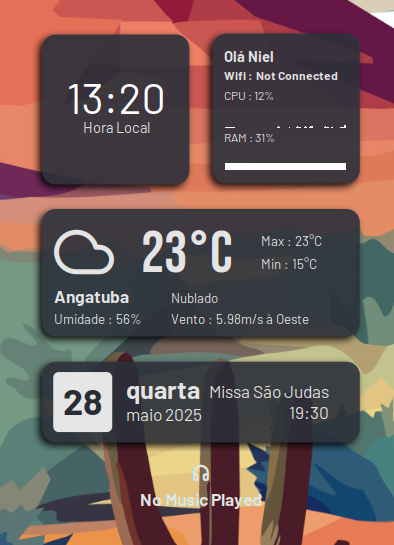

# Project README (English)



## Updates (2025-05-27)

- 🔤 Field names changed to Portuguese.
- 🌡️ Added temperature fetching via **Open-Meteo API** in the `weather-v3.0.sh` script.
- 📅 New feature: **Google Calendar events integration**.

## Requirements

- [`conky`](https://github.com/brndnmtthws/conky) installed on your system.

## Installation

1. Copy the `/Shelyak-Dark` folder to `~/.config/conky/`.
2. Run the `start.sh` script.

## 🔐 Google Calendar Integration

1. **Enable access to your calendar via API:**

   a) Activate Google Calendar API:

   - Go to: https://console.cloud.google.com/
   - Create a new project.
   - Navigate to **APIs & Services > Library** and enable the **Google Calendar API**.

   b) Generate OAuth credentials:

   - Go to **Credentials > Create Credentials > OAuth 2.0 Client ID**.
   - Choose: **Desktop Application**.
   - Download the `credentials.json` file and place it in the `/scripts` folder.

   c) Install required Python packages:

   ```bash
   pip install --upgrade google-api-python-client google-auth-httplib2 google-auth-oauthlib
   ```

   - It is recommended to create a virtual environment named `venv-google-calendar`.
